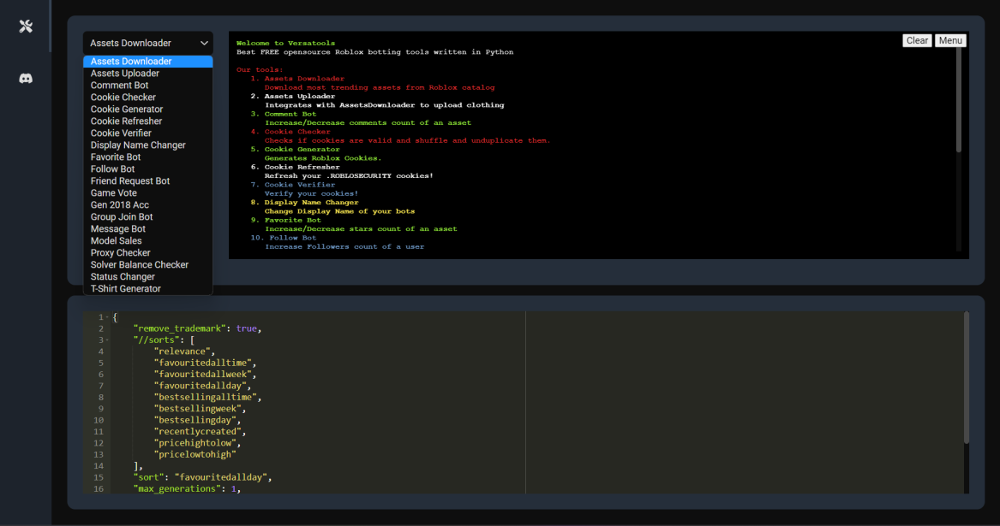

<p align="center">
	<a href="https://discord.gg/sV359yYZHY"></a>
</p>

<h4 align="center">VERSATOOLS - FREE MULTITOOL | BOT FOLLOWERS/GROUP JOINS & MORE</h4>
<p align="center">
	Best FREE opensource Roblox botting tools written in Python.
</p>

<p align="center">
	<a href="#installation">Installation</a> •
	<a href="#file-templates">File templates</a> •
  <a href="https://garry.lol/versatools">Website</a> •
	<a href="https://discord.gg/sV359yYZHY">Discord server</a>
</p>
<br/>

## Screenshot



## Installation

This installation is designed for Windows. If you want to use Versatools on Mac/Linux, run it from source.

Download the latest stable Windows release from [here](https://garry.lol/versatools/).

## Running from source

First clone this repository:

```bash
git clone
```

Then install the requirements:

```bash
pip install -r requirements.txt
```

Finally, run the program:

```bash
python src/main.py
```

To run unit tests:

```bash
python -m unittest discover src
```

To package the program into an exe:

```bash
python -m eel src/main.py src/web --windowed --icon="icon.ico" --add-binary '.venv/Lib/site-packages/tls_client/dependencies/tls-client-64.dll;tls_client/dependencies'
```

## File templates

Versatools folder is located by default in `C:\Users\%username%\Documents\versatools`

### files/config.json

All attributes are mandatory. Removing them will break the program.

### files/cookies.txt

Add your cookies in this file. You can generate them using our Cookie Generator tool.

### files/proxies.txt

You can use this template to add your proxies. We currently support HTTP, SOCKS4 and SOCKS5 proxies.

```
8.8.8.8:5001 (here will be http by default)
socks4:8.8.8.8:5002
socks5:8.8.8.8:5003:username:password
```

or you can decide to not specify the type of proxy and let the proxy checker check it for you.

```
8.8.8.8:5001
8.8.8.8:5002
8.8.8.8:5003:username:password
```

## Star History

<a href="https://star-history.com/#garryybd/versatools&Timeline">
  <picture>
    <source media="(prefers-color-scheme: dark)" srcset="https://api.star-history.com/svg?repos=garryybd/versatools&type=Timeline&theme=dark" />
    <source media="(prefers-color-scheme: light)" srcset="https://api.star-history.com/svg?repos=garryybd/versatools&type=Timeline" />
    
  </picture>
</a>

## Show your support

If you want to support the development of Versatools, you can donate to me:

- Donate to me in Bitcoin: bc1q9pvj2apxpym5yws92y7gd98y7q57hgj9vgeetr
- Donate to me in Ethereum: 0x8dCb5195cD30ec3fC0bfaF95C7528e8F1254438b
- Donate to me in Litcoin: LfBUdmmkFbN9vNho3iAv8qowcdjakkT4zZ
